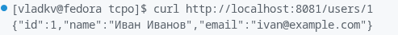
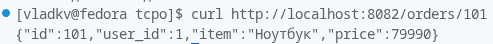
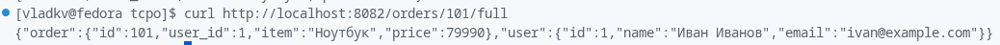

# Практическое занятие №1

## Автор
Курков Владислав Николаевич 
ПИМО-01-25

## Тема
Разделение монолита на 2 микросервиса. Взаимодействие через HTTP.

## Цель работы
Реализовать два независимых Go-сервиса (`user-service` и `order-service`) и организовать между ними обмен данными по HTTP в формате JSON.

## Краткое описание
Проект демонстрирует базовый переход от монолитного подхода к микросервисному:
- `user-service` хранит и отдает данные пользователей;
- `order-service` хранит заказы и по запросу получает данные пользователя из `user-service`.

Таким образом, полный ответ по заказу формируется через межсервисный HTTP-вызов, а не через прямой вызов функции внутри одного приложения.

## Структура проекта
```text
pz1-microservices/
├── user-service/
│   ├── cmd/server/main.go
│   ├── internal/user/model.go
│   ├── internal/user/repo.go
│   ├── internal/user/handler.go
│   └── go.mod
└── order-service/
    ├── cmd/server/main.go
    ├── internal/order/model.go
    ├── internal/order/repo.go
    ├── internal/order/client.go
    ├── internal/order/handler.go
    └── go.mod
```

## Границы сервисов
- `user-service` отвечает только за пользователей и маршрут `GET /users/{id}`.
- `order-service` отвечает только за заказы и маршруты `GET /orders/{id}`, `GET /orders/{id}/full`.
- `order-service` не хранит полные данные пользователя, а запрашивает их у `user-service` по HTTP.
- Сервисы запускаются отдельно и взаимодействуют только через API.

## Эндпоинты
### user-service (`:8081`)
- `GET /users/{id}` — получить пользователя по ID.

### order-service (`:8082`)
- `GET /orders/{id}` — получить заказ по ID.
- `GET /orders/{id}/full` — получить заказ вместе с данными пользователя.

## Запуск
Открыть 2 терминала.

Терминал 1:
```bash
cd user-service
go run ./cmd/server
```

Терминал 2:
```bash
cd order-service
go run ./cmd/server
```

## Проверка
```bash
curl http://localhost:8081/users/1
curl http://localhost:8082/orders/101
curl http://localhost:8082/orders/101/full
```

Проверка отказа внешнего сервиса:
1. Остановить `user-service`.
2. Вызвать `curl http://localhost:8082/orders/101/full`.
3. Ожидается ошибка интеграции (`502 Bad Gateway` в учебном сценарии).

## Примеры запросов и скриншоты
### 1. Получение пользователя
```bash
curl http://localhost:8081/users/1
```



---

### 2. Получение заказа
```bash
curl http://localhost:8082/orders/101
```



---

### 3. Получение агрегированного ответа (заказ + пользователь)
```bash
curl http://localhost:8082/orders/101/full
```


---

### 4. Сценарий ошибки при остановленном `user-service`
```bash
curl http://localhost:8082/orders/101/full
```


## Вывод
В ходе практики реализована простая распределенная система из двух микросервисов с разделением ответственности и HTTP-взаимодействием. Работа показала основные преимущества микросервисов (независимость и гибкость) и ключевые ограничения (сетевые ошибки, таймауты, зависимость от доступности внешнего сервиса).

## Контрольные вопросы (ответы)
1. Чем монолит отличается от микросервисной архитектуры?
Монолит — одно приложение и один процесс со всей логикой. Микросервисы — несколько независимых сервисов с отдельным запуском и сетевым взаимодействием.

2. Почему разделение системы на сервисы не всегда является лучшим решением?
Потому что вместе с гибкостью растет сложность: сетевые ошибки, таймауты, сложнее тестирование, отладка, мониторинг и инфраструктура.

3. Какую ответственность в этой работе несет `user-service`, а какую — `order-service`?
`user-service` отвечает за данные пользователей. `order-service` отвечает за данные заказов и собирает полный ответ, запрашивая пользователя по HTTP.

4. Почему в микросервисной архитектуре важно обрабатывать таймауты и сетевые ошибки?
Потому что межсервисные вызовы идут по сети, а сеть ненадежна: сервис может быть недоступен, отвечать медленно или вернуть ошибочный статус.

5. Что означает статус `502 Bad Gateway` в контексте взаимодействия сервисов?
Это означает, что сервис-шлюз (в нашем случае `order-service`) не смог корректно получить ответ от зависимого внешнего сервиса (`user-service`).

6. Почему один сервис не должен напрямую обращаться к внутренним структурам кода другого сервиса?
Потому что сервисы должны быть слабо связаны и взаимодействовать только через публичный API-контракт, иначе теряется независимость и усложняется развитие системы.

7. Какие преимущества дает разделение на сервисы при росте проекта?
Независимый деплой, локальное масштабирование нагруженных частей, четкие границы ответственности, удобнее распределять работу между командами.

8. Какие новые сложности появляются после такого разделения?
Управление сетевыми отказами, согласование API-контрактов, наблюдаемость (логи/метрики), распределенная отладка и дополнительная инфраструктура.
