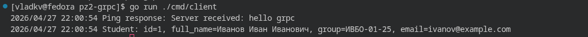
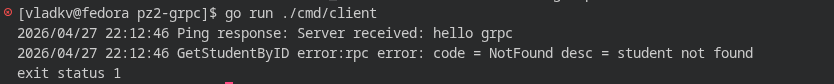

# Практическое занятие №2

## Автор
Курков Владислав Николаевич  
ПИМО-01-25

## Тема
gRPC: создание простого микросервиса, вызовы методов.

## Цель работы
Реализовать учебный gRPC-сервис на Go с контрактом в `proto`, сгенерированным кодом, серверной реализацией и клиентом для вызова методов.

## Краткое описание
Проект демонстрирует базовый gRPC-подход для взаимодействия сервисов:
- контракт описан в `student.proto`;
- сервер реализует методы `Ping` и `GetStudentByID`;
- клиент подключается к серверу и вызывает эти методы;
- данные о студентах хранятся в памяти репозитория.

Такой подход показывает принцип contract-first: сначала контракт (`.proto`), затем реализация и вызовы через типизированный клиент.

## Структура проекта
```text
pz2-grpc/
├── proto/
│   └── student.proto
├── cmd/
│   ├── server/
│   │   └── main.go
│   └── client/
│       └── main.go
├── internal/
│   └── student/
│       ├── data.go
│       └── service.go
├── gen/
│   └── studentpb/
│       ├── student.pb.go
│       └── student_grpc.pb.go
├── go.mod
└── go.sum
```

## Границы компонентов
- `proto/student.proto` — контракт сервиса и сообщений.
- `gen/studentpb` — сгенерированные protobuf/gRPC типы и интерфейсы.
- `internal/student` — бизнес-логика сервиса и доступ к данным.
- `cmd/server` — запуск gRPC-сервера на `:50051`.
- `cmd/client` — клиентские вызовы `Ping` и `GetStudentByID`.

## RPC-методы
### StudentService
- `Ping(PingRequest) returns (PingResponse)` — проверка доступности сервиса.
- `GetStudentByID(GetStudentRequest) returns (GetStudentResponse)` — получение студента по ID.

## Запуск
Открыть 2 терминала в `pz2-grpc`.

Терминал 1:
```bash
go run ./cmd/server
```


Терминал 2:
```bash
go run ./cmd/client
```


## Проверка
Ожидаемый пример вывода клиента:
```text
Ping response: Server received: hello grpc
Student: id=1, full_name=Иванов Иван Иванович, group=ИВБО-01-25, email=ivanov@example.com
```

Проверка сценария ошибки:
1. В `cmd/client/main.go` изменить `Id: 1` на `Id: 999`.
2. Снова запустить `go run ./cmd/client`.
3. Ожидается gRPC-ошибка `NotFound`.



## Перегенерация кода из proto
При изменении `proto/student.proto` нужно заново выполнить генерацию:
```bash
protoc --proto_path=proto --go_out=. --go-grpc_out=. proto/student.proto
```

## Вывод
В ходе практики реализован минимальный, но полноценный gRPC-микросервис: описан контракт, сгенерированы типы, поднят сервер, реализован клиент и отработаны как успешный, так и ошибочный сценарии вызова.

## Контрольные вопросы (ответы)
1. Что такое gRPC?  
gRPC — это framework удаленного вызова процедур (RPC), где клиент вызывает методы удаленного сервиса как локальные.

2. Какую роль играет `.proto`-файл?  
`.proto` задает контракт: структуры сообщений, сервисы и методы.

3. Для чего нужен `protoc`?  
`protoc` компилирует `.proto` и генерирует код для конкретного языка.

4. Зачем нужны `protoc-gen-go` и `protoc-gen-go-grpc`?  
`protoc-gen-go` генерирует Go-типы protobuf-сообщений, `protoc-gen-go-grpc` — gRPC-клиент и серверные интерфейсы.

5. Чем gRPC отличается от HTTP JSON API?  
gRPC работает вокруг RPC-методов и строгого контракта, а HTTP JSON API обычно строится вокруг URL и JSON.

6. Почему контракт в gRPC считается строго типизированным?  
Потому что типы и поля фиксируются в `.proto`, а затем используются в сгенерированном коде без ручного согласования.

7. Что делает gRPC-клиент в этой работе?  
Подключается к серверу, вызывает `Ping` и `GetStudentByID`, получает структурированный ответ.

8. Что происходит при запросе несуществующего студента?  
Сервер возвращает ошибку `NotFound`, клиент получает gRPC-статус с кодом ошибки.
